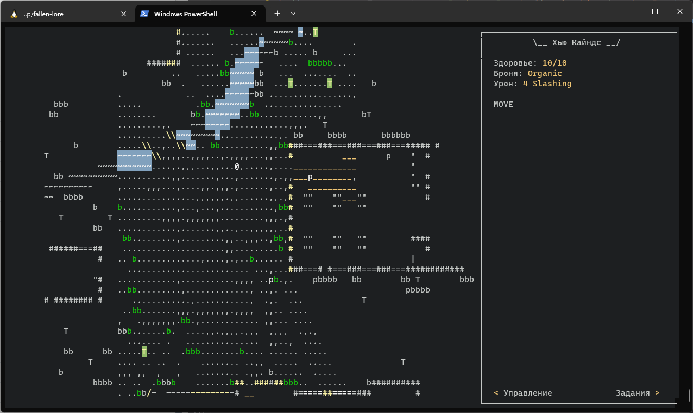

### Hello there 👋

Quick overview:

- I work as **Backend developer**
- I am currently learning **game design stuff**
- I admire **Lua** and **LÖVE**
- I have a habit of compulsively developing **games**. My current one is [Fallen](https://github.com/girvel/fallen), adventure/RPG on LÖVE, inspired by and compatible with the most popular tabletop RPG. Check it out.
- It also has a massive precursor: [Fallen (on python)](https://github.com/girvel/fallen_python), detail-focused TUI mini-RPG. I revisited my ECS library a year after I wrote it, and its quality did not cause me to cry, so I was kind of inspired to try and build something on top of it. The project was a bit more about beauty of the code behind the game than the game itself. I got a bit overzealous and wrote too much high-level functionality and very moderate amount of features.
- I am quite proud of my [own interpretation of ECS](https://github.com/girvel/ecs) on python. System are functions with **annotation**-based syntax, that are applied to **cartesian product** of entities that match arguments' annotations. Almost **dynamic** (you can dynamically add a component to the entity, but you can not dynamically add a system), somewhat **asynchronous** (it uses yield instead of await because it fits better).
- Another one of my games is [Rex Astra](https://github.com/girvel/rex_astra), very very simple RTS built with LOVE.
- I wrote [Tiny Storage](https://github.com/girvel/tiny_storage) -- a minimalistic YAML **config** management library for Python, that is often quite helpful.
- I am very open to collaborations. I would love to write something open-source in a team. Contact me on my telegram [@girvel](https://t.me/girvel), discord [Girvel#7522](https://discordapp.com/users/Girvel#7522) and email *widauka@ya.ru*.

### Screenshots

    
    
    
    

